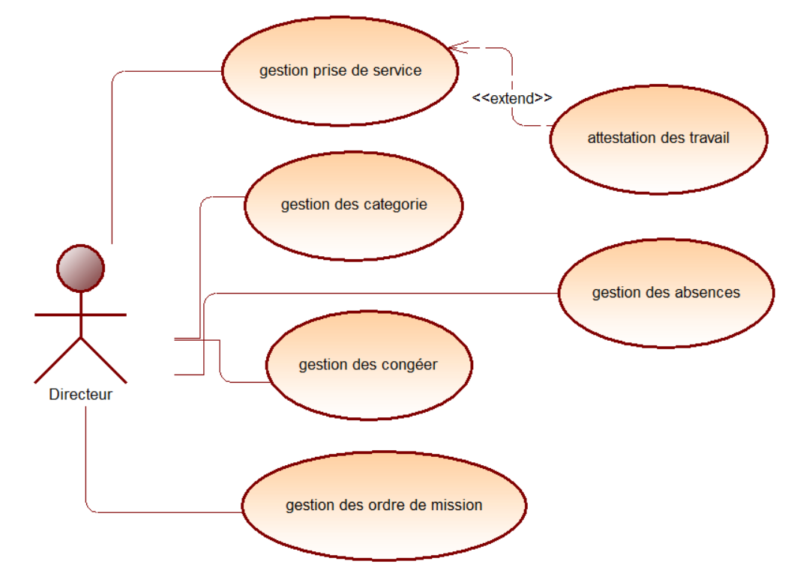

# Analyse
{:class="sectionHeader"}

<!-- new slide -->

## Empathie avec Directeur

{:width="85%"}*figure: Empathie avec Directeur*

<!-- note -->

Date : 05-01-2024

### Persona
(M. Mechrafi)

**Dite**
- doit être suivi par toutes les établissement
	- Les personnels
	- Les absence 
	- Les congé 
	- Order des mission
	- Attestation de travail

**Ce qu’il faire :**
- Table de l’inscription les  personnels en excel:
  - Matricule
  - Nom
  - Prenom
  - Nom arabe
  - Prenom arabe
  - CIN
  - Date de Naissance
  - Telephone
  - Adresse
  - Ville
  - Email
  - Affectation
  - EFP de travail
  - Specialité
  - Fonction
  - Date de recrutement 
  - Date decision

<!-- new slide -->

## Définir le problème

{:width="700px"}*figure: Définir le problème*

<!-- note -->

Le directeur de l'établissement passe énormément de temps à gérer les données des employés dans des feuilles Excel, ce qui entraîne des retards dans la prise de décisions critiques et limite la productivité globale de l'équipe en raison de la lenteur du traitement des informations, notamment en raison de l'absence de fonctionnalités de mise à jour en temps réel et de collaboration simultanée.

<!-- new slide -->

## Idéation

{:width="700px"}*figure: Ideation*

<!-- note -->

Conception et développement d'une application web de gestion des personnels, offrant des fonctionnalités avancées telles que la gestion des prises de service, des absences, des congés, des ordres de mission et des attestations de travail.

<!-- new slide -->
## Diagramme de cas d'utilisation

{:width="700px"}
*figure: cas d'utilisation*
<!-- new slide -->
